# Wettersymbole und Icons / Weather related symbols and icons

## Symbole / Symbols and icons

### WMO-Symbole / WMO symbols

WMO 4677 ww | WMO 4680 wawa
------------|----------------
  | 

WMO 2700 N | WMO 4561 W W1 W2
-----------|--------------
 | 

### Allgemeine Symbole, offen / General icons, non-filled

Icons nach dem Vorbild der Belchertown-Icons aber im SVG-Format / Icons like the Belchertown icons but in SVG format

-->    | klar / clear | heiter / fair | wolkig / partly cloudy | stark bewölkt / mostly cloudy | bedeckt / overcast
----|-------------|--------------|-------------------------|-------------------------------|---------------------
Tag /day |  | 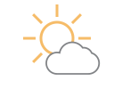 | 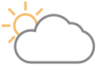 | 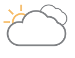 | 
Nacht / night | |  |  |  | wie Tag / like day
N | 0/8 | 1/8, 2/8 | 3/8, 4/8, 5/8 | 6/8, 7/8 | 8/8
Tag-Wind /day-wind | 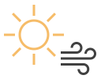 | 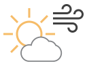 | 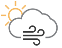 | 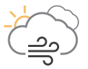 | 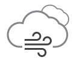
Nacht-Wind / night-wind | |  |  |  | wie Tag / like day

Wind / wind | Sandsturm / sandstorm | Schneetreiben / blowing snow | Tornado
------------|-----------------------|------------------------------|------------
 |  |  | 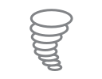

Nebel / fog | Schneefall / snow | Sonne und Mond / sun and moon
------------|-------------------|---------------
 | 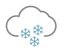 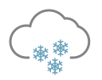 | 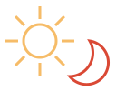

Niesel / drizzle | Regen / rain | Schneeregen / sleet | Hagel / hail |
-----------------|--------------|---------------------|--------------|
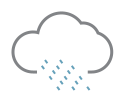 | 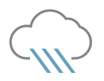 | 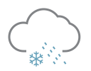 |  | 

gefrierender Niesel / freezing drizzle | gefrierender Regen / freezing rain | Glatteis / glaze ice 
-----------------------------------|------------------|----------------------
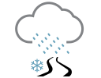 | 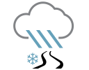 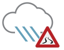 | 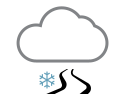 

Wetterleuchten / lightning | Gewitter / thunderstorm | Hagelgewitter / thunderstorm with hail
---------------------------|-------------------------|---------------------------------------
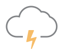 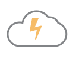 | 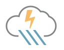 | 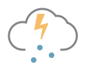

Sandsturmgewitter / thunderstorm with sandstorm |
------------------------------------------------|
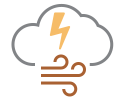 |

Regentropfen / raindrop | Schneeflocke / snowflake | keine Daten / no data 
------------------------|--------------------------|-----------------------
 |   |  

### Allgemeine Symbole, gefüllt / General icons, filled

Icons nach dem Vorbild der Belchertown-Icons aber im SVG-Format / Icons like the Belchertown icons but in SVG format

-->    | klar / clear | heiter / fair | wolkig / partly cloudy | stark bewölkt / mostly cloudy | bedeckt / overcast
----|-------------|--------------|-------------------------|-------------------------------|---------------------
Tag /day |  |  |  |  | 
Nacht / night | |  |  | 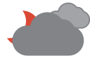 | wie Tag / like day
N | 0/8 | 1/8, 2/8 | 3/8, 4/8, 5/8 | 6/8, 7/8 | 8/8
Tag-Wind /day-wind |  |  |  |  | 
Nacht-Wind / night-wind | |  |  | 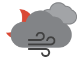 | wie Tag / like day

Wind / wind | Sandsturm / sandstorm | Schneetreiben / blowing snow
------------|-----------------------|-------------------------------
 |  |  

Nebel / fog | Schneefall / snow | Sonne und Mond / sun and moon
------------|-------------------|---------------
 | 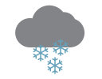 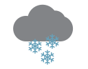 | 

Niesel / drizzle | Regen / rain | Schneeregen / sleet | Hagel / hail |
-----------------|--------------|---------------------|--------------|
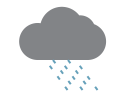 | 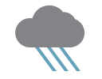 | 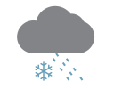 | 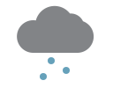 | 

gefrierender Niesel / freezing drizzle | gefrierender Regen / freezing rain | Glatteis / glaze ice 
-----------------------------------|------------------|----------------------
 |   |  

Wetterleuchten / lightning | Gewitter / thunderstorm | Hagelgewitter / thunderstorm with hail
---------------------------|-------------------------|---------------------------------------
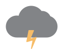 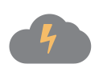 | 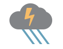 | 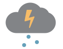

Sandsturmgewitter / thunderstorm with sandstorm |
------------------------------------------------|
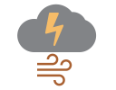 |

Regentropfen / raindrop | Schneeflocke / snowflake | keine Daten / no data 
------------------------|--------------------------|-----------------------
 |   |  

### Photovoltaik-Symbole / photovoltaics icons

Photovoltaik / photovoltaics | heiter/with cloud | Solarpanel/pv panel | Batterie/accumulator
-----------------------------|---------------------|---------------------|-----------------
 |  |  | 

----------------------------------------------------------------------------

### Photovoltaik-Symbole, gefüllt / photovoltaics icons, filled

Photovoltaik / photovoltaics | heiter/with cloud | Solarpanel/pv panel | Batterie/accumulator
-----------------------------|---------------------|---------------------|-----------------
 |  |  | 

----------------------------------------------------------------------------

## Lizenz und Nutzungsrechte

Die Symbole der Code-Tabelle 4677 stammen ursprünglich von Wikimedia-Commons
und sind dort der Public Domain (PD) zugeordnet. Sie wurden von mir 
bearbeitet, insbesondere eingefärbt. Für Code-Tabelle 4680 fehlende 
Symbole wurden von mir selbst gestaltet.

Die Symbole können im nichtkommerziellen Bereich frei verwendet werden.
Die Werke müssen auch nicht unter die GPL gestellt werden (Fonts
Exclusion). Bearbeitungen der Symbole selbst unterliegen dagegen
der GPL.

## License and Usage

The symbols of code table 4677 are based on Wikimedia Commons, where
they are marked as released to the Public Domain (PD). They have been 
edited, especially colored. Missing symbols for code table 4680 I created 
by myself.

In non-commercial domain the symbols can be freely used. What you create
using these symbols is not required to be subject to the GPL (fonts
exclusion). However, the GPL applies to editing the symbols themselves.

## Danksagungen / Credits

* Pat O'Brien for the [Belchertown skin icons](https://github.com/poblabs/weewx-belchertown)
* National Oceanic and Atmospheric Administration for creating the WMO symbol files and releasing them to the public domain

## Links

* [Wetterzustand / present weather](https://www.woellsdorf-wetter.de/info/presentweather.html)
* [Belchertown skin for WeeWX](https://github.com/poblabs/weewx-belchertown)
* [Wettervorhersage / weather forecast](https://github.com/roe-dl/weewx-DWD)
* [WeeWX](https://weewx.com)
* [Open-Meteo](https://open-meteo.com)
* [Verkehrszeichen Schleudergefahr](https://commons.wikimedia.org/wiki/File:Bild_111_-_Schleudergefahr,_StVO_DDR_1977.svg?uselang=de)
