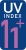

# UV-Index / UV index

Mit dem UV-Index wird vor Sonnenbrandgefahr gewarnt.

The UV index is used to warn of the risk of sunburn.

## Symbole / symbols

UV | 0 | 1 | 2 | 3 | 4 | 5 | 6 | 7 | 8 | 9 | 10 | 11 |
---|---|---|---|---|---|---|---|---|---|---|----|----|
Symbol |  |  |  |  |  |  |  |  |  |  |  |  |

Hinweis / instruction | Bekleidung / clothing | Schatten / shadow | im Haus bleiben / stay indoor
----------------------|----------------------|-------------------|------------------------------
original |  |  | 
reversed |  |  | 

## Lizenz und Nutzungsrechte

Für die Nutzung ist eine Lizenz der WHO erforderlich. Sie kann über das
[Online-Formular Nutzungserlaubnis](https://www.who.int/about/policies/publishing/permissions)
beantragt werden.

Die WHO hat die Lizenz zum Veröffentlichen dieser Dateien an dieser Stelle
erteilt.

## License and Usage

To use these symbols you need a license granted by the WHO. You can request
that license using the 
[online permissions form](https://www.who.int/about/policies/publishing/permissions).

The WHO granted the right to publish these files here.

## Links

* [GLOBAL SOLAR UV INDEX A Practical Guide](https://iris.who.int/bitstream/handle/10665/42459/9241590076.pdf?sequence=1)
* [World Health Organization (WHO)](https://www.who.int)
* [Wetterstation Wöllsdorf](https://www.woellsdorf-wetter.de)
