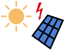
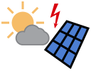

# Photovoltaik / Photovoltaics

## Inhalt dieses Verzeichnisses / Contents of this directory

Das SVG-Format der Dateien ermöglicht eine problemlose Skalierung 
(Vergrößerung, Verkleinerung) und Anpassung sowie Erweiterung um 
zusätzliche Icons.

Because of the Scalable Vector Format (SVG) of these files, they can 
easily be scaled and edited, and also, additional icons can be derived 
from them.

Photovoltaik/photovoltaics | heiter/fair | Nacht/night
---------------------------|---------------------|---------------------
 |  | 

Solarpanel/pv panel | Batterie/accumulator
---------------------------|---------------------
 | 

## Dunkler Hintergrund / Dark mode

Wird die Datei mit `` eingefügt, wird der Rahmen des Solarpanels
schwarz dargestellt.

Soll das Bild auch auf Webseiten mit dunklem Hintergrund verwendet werden,
kann der Bereich von `<svg` bis `</svg>` direkt in die HTML-Datei eingefügt
werden. Bei dieser Verwendungsweise wird der Rahmen des Solarpanels
automatisch in derselben Farbe wie die Schrift dargestellt, also bei
hellem Hintergrund dunkel und bei dunklem Hintergrund hell.

If you reference the file by `` the border of the solar panel is
displayed in black.

To use the file on web pages with dark background, include the part
from `<svg` to `</svg>` into the HTML file directly. Then the panel
is displayed with the same color as the text. This is dark on light
background and light on dark background.

## Lizenz und Nutzungsrechte

Die Icons können im nichtkommerziellen Bereich frei verwendet werden.
Die Werke, in denen sie verwendet werden, müssen auch nicht unter die 
GPL gestellt werden (Fonts Exclusion). Bearbeitungen der Icons selbst 
unterliegen dagegen der GPL.

## License and Usage

In non-commercial domain the icons can be freely used. What you create
using these icons is not required to be subject to the GPL (fonts
exclusion). However, the GPL applies to editing the icons themselves.
