# Wetter-Icons im SVG-Format / Weather icons in SVG format

## Inhalt dieses Verzeichnisses / Contents of this directory

Das SVG-Format der Dateien ermöglicht eine problemlose Skalierung
(Vergrößerung, Verkleinerung) und Anpassung sowie Erweiterung um
zusätzliche Icons.

Because of the Scalable Vector Format (SVG) of these files, they can
easily be scaled and edited, and also, additional icons can be derived
from them.

-->    | klar / clear | heiter / fair | wolkig / partly cloudy | stark bewölkt / mostly cloudy | bedeckt / overcast
----|-------------|--------------|-------------------------|-------------------------------|---------------------
Tag /day |  | 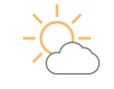 | 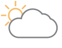 |  | 
Nacht / night | |  |  |  | wie Tag / like day
N | 0/8 | 1/8, 2/8 | 3/8, 4/8, 5/8 | 6/8, 7/8 | 8/8
Tag-Wind /day-wind | 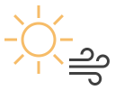 | 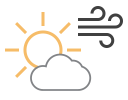 | 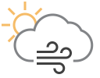 | 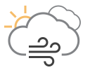 | 
Nacht-Wind / night-wind | |  |  |  | wie Tag / like day

Wind / wind | Sandsturm / sandstorm | Schneetreiben / blowing snow | Tornado | Sonne und Mond / sun and moon
------------|-----------------------|------------------------------|---------|-----
 |  |  |  | 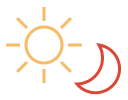

Nebel / fog | gefrierender Niesel / freezing drizzle |gefrierender Regen / freezing rain | Glatteis / glaze ice
------------|-------------|-------------------|------------------------------------
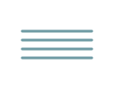 | 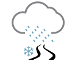 | 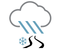 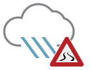 | 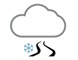

Niesel / drizzle | Regen / rain | Schneeregen / sleet | Hagel / hail | Schneefall / snow
-----------------|--------------|---------------------|--------------|-------------------
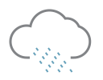 | 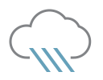 | 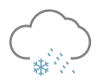 |  | 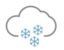 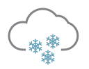

Wetterleuchten / lightning | Gewitter / thunderstorm | Hagelgewitter / thunderstorm with hail
---------------------------|-------------------------|---------------------------------------
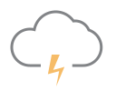 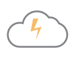 | 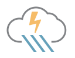 | 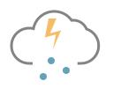

Regentropfen / raindrop | Schneeflocke / snowflake | keine Daten / no data
------------------------|--------------------------|-----------------------
 |   | 

## Lizenz und Nutzungsrechte

Diese Icons wurden von mir nach dem Vorbild der Belchertown-Icons 
programmiert. 

Die Icons können im nichtkommerziellen Bereich frei verwendet werden.
Die Werke, in denen sie verwendet werden, müssen auch nicht unter die 
GPL gestellt werden (Fonts Exclusion). Bearbeitungen der Icons selbst 
unterliegen dagegen der GPL.

## License and Usage

I created these icons inspired by the Belchertown icons.

In non-commercial domain the icons can be freely used. What you create
using these icons is not required to be subject to the GPL (fonts
exclusion). However, the GPL applies to editing the icons themselves.

## Danksagungen / Credits

* Pat O'Brien for the [Belchertown skin icons](https://github.com/poblabs/weewx-belchertown)
