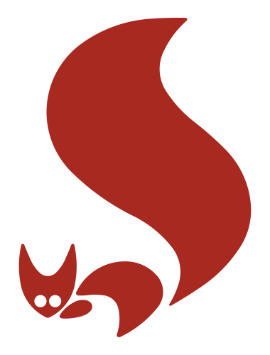

# Waldschutzsymbole / Wildfire protection symbols

## Inhalt dieses Verzeichnisses / Contents of this directory

Das SVG-Format der Dateien ermöglicht eine problemlose Skalierung
(Vergrößerung, Verkleinerung) und Anpassung sowie Erweiterung um
zusätzliche Icons.

Because of the Scalable Vector Format (SVG) of these files, they can
easily be scaled and edited, and also, additional icons can be derived
from them.

## Lizenz und Nutzungsrechte

Das Waldbrandeichhörnchen `wildfiresquirrel.svg` darf **AUSSCHLIEßLICH**
im Zusammenhang mit Waldbrandschutz und Waldbrandgefahren verwendet
werden. Mißbräuchliche Nutzung kann durch die Forstverwaltungen der
deutschen Bundesländer verfolgt werden.

Die Symbole können im nichtkommerziellen Bereich frei verwendet werden.
Die Werke müssen auch nicht unter die GPL gestellt werden (Fonts
Exclusion). Bearbeitungen der Symbole selbst unterliegen dagegen
der GPL.

## License and Usage

The wildfire squirrel `wildfiresquirrel.svg` **MUST NOT** be used for 
other purposes than wildfire protection information or wildfire danger 
information. Abuse may be prosecuted by the forest administrations
of the german federal states.

In non-profit domain the symbols can be freely used. What you create
using these symbols is not required to be subject to the GPL (fonts
exclusion). However, the GPL applies to editing the symbols themselves.

## Herkunft des Waldbrandeichhörnchens

Das Waldbrandeichhörnchen wird in den ostdeutschen Bundesländern zur
Kennzeichnung von Informationen über den Waldbrandschutz verwendet.
Es wurde zu einer Zeit entwickelt, als Deutschland nach dem zweiten
Weltkrieg geteilt war und diese Länder einen eigenen Staat bildeten.
Während vieles aus dieser Zeit verlorengegangen ist, wird das
Waldbrandeichhörnchen noch heute verwendet.

## History of the wildfire squirrel

The wildfire squirrel icon is used to mark information about forest protection
throughout the eastern german states. It was created at the time when 
Germany was divided into two separate countries after World War II, and 
those states belonged to the smaller and weaker one of them. While
much has been lost since then, the wildfire squirrel icon has lasted by now.

## Links

* [Sachsenforst](https://www.wald.sachsen.de/waldbrandgefaehrdung-4186.html)
* [Landesforstanstalt Mecklenburg-Vorpommern](https://www.wald-mv.de/waldprojekte/waldbrandschutz/)
* [Landeszentrum Wald Sachsen-Anhalt](https://landeszentrumwald.sachsen-anhalt.de/waldschutz/waldbrandschutz)
* [allgemeine Informationen zum Waldbrandschutz](https://www.woellsdorf-wetter.de/info/wildfire.html)
* [Wikimedia Commons: ISO 7010 P002 Rauchverbot/No smoking](https://commons.wikimedia.org/wiki/File:ISO_7010_P002.svg)
* [Wikimedia Commons: ISO 7010 P003 Kein Feuer/No fire](https://commons.wikimedia.org/wiki/File:ISO_7010_P003.svg)
* [Grüner Pfeil](https://de.wikipedia.org/wiki/Gr%C3%BCnpfeil)
